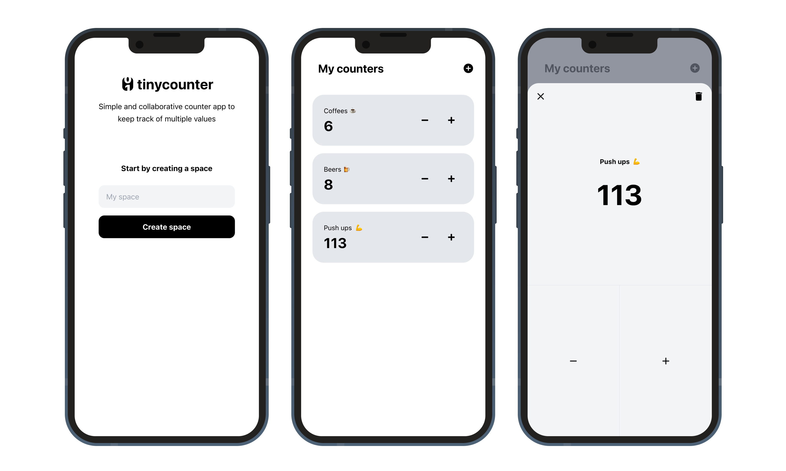

<br/>
<p align="center">
  <a href="https://tinycounter.herokuapp.com/" target="_blank" rel="noopener noreferrer">
    
  </a>
</p>
<br/>
<p align="center">
  <a href="https://tinycounter.herokuapp.com/"></a>
  <a href="./LICENSE"></a>
</p>
<br/>

# tinycounter

> Collaborative counter web app to keep track of multiple values

I created this project because I was looking for a simple counter app that can share its state in real-time between multiple devices — no account required, no app to download, and especially no ads.

This project is built with [TypeScript](https://www.typescriptlang.org/), [React](https://reactjs.org/), [Apollo GraphQL](https://www.apollographql.com/) and [Prisma](https://www.prisma.io/). Combining those technologies offers a great developper experience 🚀



## Getting started

### Prerequisites

To run the app locally, you'll need the following tools:

- [Node 16.x](https://nodejs.org/en/)
- [Docker](https://docs.docker.com/get-docker/)

### Installation

1. Install project dependencies
   ```sh
   yarn install
   ```
2. Make a copy of [`.env.template`](./.env.template) into a `.env` file.

### Start the database

Run the following command to start the Postgres database inside of a docker container

```sh
yarn db:start
```

Then, you can initialize tables in the database with this command:
sh

```
npx prisma migrate dev
```

This command will the data model defined in [schema.prisma](./prisma/schema.prisma) to the database schema and generate type definitions for prisma client in `node_modules/@prisma/client` folder.

### Start the app

Launch the GraphQL server with this command:

```
yarn dev:server
```

Then start the React application with the following command:

```
yarn dev:client
```

The app is now live on http://localhost:3000 ✨

## Available Scripts

In the project directory, you can run:

#### `yarn db:start`, `yarn db:stop`

Start and stop the Postgres container.

#### `yarn prisma:studio`

Launch [Prisma studio](https://www.prisma.io/studio) GUI to explore and manipulate the data in the database.

#### `yarn codegen:prisma`

Reads Prisma schema and generates the Prisma Client code in the `node_modules/@prisma/client` folder. It provides a type-safe query builder and Typescript definitions for all database models.

You'll need to run this command whenever you make changes in the database Schema to update the generated code.

#### `yarn codegen:graphql`

This command uses [GraphQL Code Generator](https://www.graphql-code-generator.com/) to generate Typescript definitions for:

- GraphQL resolvers on the server.
- GraphQL queries made on the client. The [typescript-react-apollo](https://www.graphql-code-generator.com/plugins/typescript-react-apollo) plugin generates reusable React hooks to send GraphQL queries.
- GraphQL queries made during tests. The [gql-tag-operations-preset](https://www.graphql-code-generator.com/plugins/gql-tag-operations-preset) preset is used to generate typings for inline `gql` usage. So need to import types from anywhere, it's just magic 🪄

You'll need to run this command whenever you make changes to the GraphQL Schema or client-side or test queries to update the generated code.

Alternatively, you can run the command once in watch mode:

```sh
yarn codegen:graphql --watch
```

#### `yarn codegen`

Run both `codegen:graphql` and `codegen:prisma`

### `yarn test`

Run tests.

For [integration tests](./server/__tests__/integration.spec.ts) to run correctly, you'll need to start the database container with `yarn db:start`

#### `yarn build`

Build the server and client projects for production.

#### `yarn start`

Command to run after running `yarn build` to start the app in production mode.

## License

[MIT](LICENSE) license.
